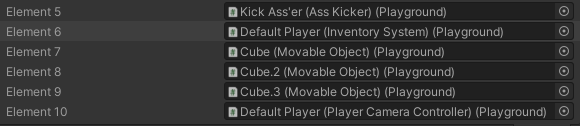
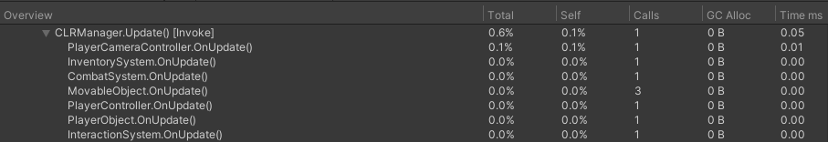

# CLR Manager
Update manager replacement for MonoBehvaiour in Unity Engine inspired by famous [article](https://blog.unity.com/technology/1k-update-calls) about 10 000 update calls. 
However, this implementation also offers additional features, such as:
* Aggregation by type. As discussed [here](https://www.youtube.com/watch?v=CBP5bpwkO54), calling same virtual function is much better for cache coherency and thus provides better performance.

    

    Notice how objects of type `MovableObject` are coupled toghether.
* Run.After and Run.Before attributes. Allows all instances of some class to be updated before instances of another class. Works only for between CLRScripts
* Component caching. By default, any CLRScript on awake tries to cache ALL components of its game object into global dictionary. This way you can later use `this.GetUnsafe<T>` to get any component. My test shows, that this is 5-10 times faster than using GetComponent. Though this behaviour is disabable by using either attribute `[DontCacheComponents]` or disabling this behaviour entirely using define `CLR_NO_CACHE`.
* Nice profiling. Not only it shows nice stats in Profiler windows, but string are preallocated and thus, don't cause GCAllocs every frame.
    
* New calls. Exposes PreUpdate and EarlyUpdate as virtual functions.

## Install
To instal package just use PackageManager and download it through git url, or import package into your assets folder.

## Quick Start
To start using new manager you need to derive you script from `CLRScript` (in `HostGame` namespace). Now the only difference between this manager and MonoBehvaiour is that instead of typing `void Update` you need to use virtual methods so it'll look like `public override void OnUpdate()`. Just create the script and following example should work, no setup required:
```csharp
class MyClass : CLRScript 
{
    public override void OnUpdate()
    {
        Debug.Log("Hello world!");
    }
}
```
There is also a file in Resources folder called `CLR_Ex_Order.asset`. You should add this to your gitignore, since this file is generated automatically each recompile.

_Note: Exceptions are not handled by CLRManager. If any of your scripts throws whole loop will be aborted_

## Available methods
Next methods are just mimicing MonoBehaviour methods:
* OnAwake
* OnStart
* OnUpdate 
* OnFixedUpdate
* OnLateUpdate 
* OnEnabled
* OnDisabled
* OnDestroyed

Now next 3 are new to the system:
* OnEarlyUpdate - Called at the start of each frame even before FixedUpdate.
* OnPreUpdate - Called after FixedUpdate but before Update each frame.
* OnManagedStart - Called before EarlyUpdate first time CLRManager picks up CLRScript.

To configure which functions are called you don't need to do anything. Currently, system checks which Update functions you implement using Reflection. Which may __seem__ like a slow operation, but after testing 700 objects I didn't find any big problem with this approach. In future I plan to generate Setup functions using Source Generators.

### Advanced Setup
If you want to configure calls yourself, you may just override `Setup` function like this:
```csharp
// Update mode has Update, FixedUpdate, LateUpdate and manual
[SerializeField] UpdateMode m_UpdateMode = UpdateMode.LateUpdate;

public override CLRSettings Setup(out bool cacheComponents)
{
    // Should components of this game object be cached into global dictionary?
    cacheComponents = true;

    // Construct enum with calls 
    Calls calls = 0;
    switch (m_UpdateMode)
    {
        case UpdateMode.Update:
            calls = Calls.Update;
            break;
        case UpdateMode.FixedUpdate:
            calls = Calls.FixedUpdate;
            break;
        case UpdateMode.LateUpdate:
            calls = Calls.LateUpdate;
            break;
        case UpdateMode.Manual:
            break;
    }

    // return your settings
    // If safety checks are false, CLRManager won't check whether or 
    // not gameObject of script is null, 
    // active in hierarchy or whether component itself is enabled or not.
    CLRSettings settings = new CLRSettings(calls, noSafeChecks: false);
    return settings;
}
```

## Execution Order
You can control execution order in 3 ways:
* `[DefaultExecutionOrder]` attribute, which will just set class order to some value
* `[Run.After(Type)]` and `[Run.Before(Type)]` which will generate execution order automatically based on execution order of given class.
* Execution Order window. System will take execution order from ProjectSettings as just number. So don't expect CLRScript to run between MonoBehaviours because all CLRScripts are executed in a single loop.

All execution IDs are stored in `CLR_Ex_Order.asset` which stores every class that has non-zero execution order.

## Component Caching
By default all GameObjects with at least one CLRScript cache their components into global dictionary. You can acess these components by using extension methods such as
```csharp
 public static T GetUnsafe<T>(this Component cmp) where T : class {}

 public static bool TryGetUnsafe<T>(this Component cmp, out T result) where T : class {}

 // Returns new array each call
 public static T[] GetAllUnsafe<T>(this Component cmp) where T : class {}
 // Populates writeTo and returns count of components
 public static int GetAllNonAlloc<T>(this Component cmp, ref T[] writeTo) where T : class {}
```
Notice that method is called `GetUnsafe`. This is because component are cached during OnAwake call. You shouldn't use this on prefabs or objects that have no CLRScript attached. Interfaces and base classes are supported as `<T>` argument. This line will work:
```csharp
var component = this.GetUnsafe<Component>();
```
You can't go deeper than `Component` into hierarchy tho, so `this.GetUnsafe<object>` will return `null`.

You can also cache components for any GameObject you want by using 
```csharp 
public static Dictionary<Type, List<object>> TryRegisterComponents(GameObject go) {}
public static void UnregisterComponents(GameObject go){}
```

If you have multiple of the same component on GameObject, GetUnsafe will return only the first one. 
