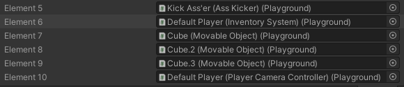
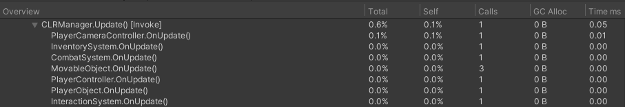

# Serenity Update Manager
Update manager replacement for MonoBehaviour in Unity Engine inspired by famous [article](https://blog.unity.com/technology/1k-update-calls) about 10 000 update calls. 
However, this implementation also offers additional features, such as:
* Aggregation by type. As discussed [here](https://www.youtube.com/watch?v=CBP5bpwkO54), calling same 
virtual function is much better for cache hits and thus provides better performance.

    

    Notice how objects of type `MovableObject` are coupled toghether.
* Also in general this means order of execution is far more predictable and reliable
* Run.After and Run.Before attributes. Allows all instances of some class to be updated before instances of another class. Works only for between SRScripts
* Nice profiling. Easy to find where all of your updates are.
    
* New calls. Exposes PreUpdate (runs before fixed update) and EarlyUpdate (runs before Update after fixed update) as virtual functions.

__Cons__:
* Update manager does not work with [ExecuteAlways]
* Since all update calls are now external, they can not be private. *But*, they are protected
* Also it is possible that FixedUpdate may be called before Start if object was Instantiated. This happens for default MonoBehaviours too by the way
* Every SRScript has Awake, Start, OnEnable, OnDisable and OnDestroyed callbacks regardless of you using them
* Currently, SerenityManager adds and removes script from its list every time you enable/disable component. So if you switch it every frame it may become a problem (May not, I didn't measure)

## Installing
- Go to package manager.
- Click Add Package button (Plus icon), select "Add package from Git URL..."
- Paste this: `https://github.com/SanielX/Serenity-Update-Manager`
- Click Add

Note that you need Git installed on your computer for this to work, you can grab it [here](https://git-scm.com/downloads)

## Quick Start

First of all, to automatically track which types have which update methods, 
system will create file in `Assets/Resources/_Local/Serenity_UpdateManager_Data.asset`. **You should add whole folder or just this file to your gitignore**

To start using new manager you need to derive you script from `Serenity.SRScript`.
```csharp
using Serenity;

class MyClass : SRScript 
{
    protected override void OnUpdate()
    {
        Debug.Log("Hello world!");
    }
}

```
There is also a file in Resources/_Local folder called `Serenity_UpdateManager_Data.asset`. You should add this to your gitignore, since this file is generated automatically each recompile.

_Note: Exceptions are handled if UNITY_ASSERTIONS is enabled. Otherwise, if any of your scripts throws whole loop will be aborted_

## Available methods
Next methods are just mimicking MonoBehaviour methods:
* OnAwake
* OnStart
* OnUpdate 
* OnFixedUpdate
* OnLateUpdate 
* OnEnabled
* OnDisabled
* OnDestroyed

Now next 2 are new to the system:
* OnEarlyUpdate - Called at the start of each frame even before FixedUpdate.
* OnPreUpdate - Called after FixedUpdate but before Update each frame.

To configure which functions are called you don't need to do anything. Currently, system checks which Update functions you implement using Reflection. If you don't override Setup method, system caches results into scriptable object, which is then used to build runtime dictionaries for per-type lookup.

## Execution Order
You can control execution order in 3 ways:
* `[DefaultExecutionOrder]` attribute, which will just set class order to some value
* `[Run.After(Type)]` and `[Run.Before(Type)]` which will generate execution order automatically based on execution order of given class.
* Execution Order window. System will take execution order from ProjectSettings as just number. So don't expect SRScript to run between MonoBehaviours because all SRScripts are executed in a single loop.

All execution IDs are stored in `Serenity_UpdateManager_Data.asset` which stores every class that has non-zero execution order.
Resolving execution order when using `Run.Before` and `Run.After` attributes may be undefined in cases when you have both Before and After attribute on your class or if you have created infinite loop by making cyclic dependency.

### Advanced Setup
If you want to configure calls yourself, you may just override `Setup` function like this:
```csharp
// Update mode has Update, FixedUpdate, LateUpdate and manual
[SerializeField] UpdateMode m_UpdateMode = UpdateMode.LateUpdate;

public override SerenitySetupFlags Setup()
{
    SerenitySetupFlags result = 0;

    // Should components of this game object be cached into global dictionary?
    // It does by default
    result |= UpdateSetupFlags.DontCacheComponents;

    // Construct enum with calls 
    switch (m_UpdateMode)
    {
        case UpdateMode.Update:
            result |= UpdateSetupFlags.Update;
            break;
        case UpdateMode.FixedUpdate:
            result |= UpdateSetupFlags.FixedUpdate;
            break;
        case UpdateMode.LateUpdate:
            result |= UpdateSetupFlags.LateUpdate;
            break;
        case UpdateMode.Manual:
            break;
    }

    // return your settings
    // If safety checks are false, SerenityManager won't check whether or 
    // not gameObject of script is null, 
    // active in hierarchy or whether component itself is enabled or not.
    // Though SRScript removes itself from Update list anyway when OnDisabled is called
    result |= UpdateSetupFlags.NoSafetyChecks;
    return result;
}
```

### Global Type Cache
In order to not do reflection look ups at runtime, system keeps combination of type name 
to its parameters and looks up type name only once at runtime. `GlobalTypeCache` class keeps track of all types, 
but in case you have similar system and don't want it to waste your RAM, 
you can set GlobalTypeCache.FindTypeDelegate yourself.

Also if you want to use for your own purposes you can